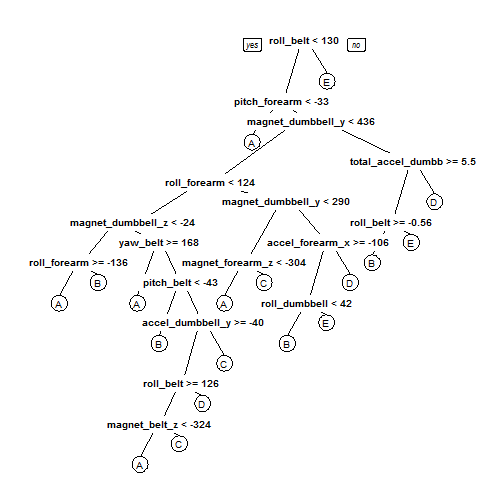

## Summary

Using devices such as Jawbone Up, Nike FuelBand, and Fitbit it is now possible to collect a large amount of data about personal activity relatively inexpensively. These type of devices are part of the quantified self movement - a group of enthusiasts who take measurements about themselves regularly to improve their health, to find patterns in their behavior, or because they are tech geeks. One thing that people regularly do is quantify how much of a particular activity they do, but they rarely quantify how well they do it. 

The goal of this project will be to use data from accelerometers on the belt, forearm, arm, and dumbell of 6 participants, which were asked to perform barbell lifts correctly and incorrectly in 5 different ways, and predict the manner in which they did the exercises.

## Loading needed packages

```r
library(utils);
suppressWarnings(suppressMessages(library(RCurl)));
suppressWarnings(suppressMessages(library(caret)));
suppressWarnings(suppressMessages(library(randomForest)));
library(foreach);
library(rpart.plot);
```

```
## Loading required package: rpart
```

## Downloading and reading data

```r
trainURL = "http://d396qusza40orc.cloudfront.net/predmachlearn/pml-training.csv";
testURL = "http://d396qusza40orc.cloudfront.net/predmachlearn/pml-testing.csv";
if(!file.exists("./data/pml-training.csv")) {
    download.file(trainURL, destfile = "./data/pml-training.csv", method = "curl");
}
if(!file.exists("./data/pml-testing.csv")) {
    download.file(testURL, destfile = "./data/pml-testing.csv", method = "curl");
}
trainD <- read.csv("./data/pml-training.csv", na.strings = c ("", "#DIV/0!", "NA"));
testD <- read.csv("./data/pml-testing.csv", na.strings = c("", "#DIV/0!", "NA"));
```
The loaded training data set contains 160 variables with 19622 observations, while the testing data set contains 160 variables but 20 observations. Since the Excel sheet contains also divisions by zero hints, the **na.strings** was adapted appropriately.

## Cleaning data
For the present problem, some irrelevant variables for the prediction and columns with all missing variables are removed.

```r
c <- trainD$classe;
keepTrain <- grepl("belt|[^(fore)]arm|dumbbell|forearm", names(trainD));
trainClean <- trainD[, colSums(is.na(trainD)) == 0 & keepTrain];
trainClean$classe <- c;
keepTest <- grepl("belt|[^(fore)]arm|dumbbell|forearm", names(testD));
testClean <- testD[, colSums(is.na(testD)) == 0 & keepTest];
```

## Modeling
### Data splitting
Prior to modelling, the data has to be splitted into a trainings set (70%) and a test set (30%) for validation purposes. For a better reproducibility, the seed has to be set.

```r
set.seed(1234);
indexTrain <- createDataPartition(trainClean$classe,  p = 0.7, list = F);
trainDat <- trainClean[indexTrain, ];
testDat <- trainClean[-indexTrain, ];
```
### Predictive modelling
The model is fitted using a **Random Forest** algorithm. A 3-fold cross-validation is used. **ntree** was set to 200, since the default value took ages with the present computation power.

```r
model <- randomForest(classe ~ ., data = trainDat);
predict <- predict(model, testDat);
confusionMatrix(testDat$classe, predict)
```

```
## Confusion Matrix and Statistics
## 
##           Reference
## Prediction    A    B    C    D    E
##          A 1674    0    0    0    0
##          B    8 1130    1    0    0
##          C    0    5 1021    0    0
##          D    0    0    4  959    1
##          E    0    0    0    1 1081
## 
## Overall Statistics
##                                           
##                Accuracy : 0.9966          
##                  95% CI : (0.9948, 0.9979)
##     No Information Rate : 0.2858          
##     P-Value [Acc > NIR] : < 2.2e-16       
##                                           
##                   Kappa : 0.9957          
##  Mcnemar's Test P-Value : NA              
## 
## Statistics by Class:
## 
##                      Class: A Class: B Class: C Class: D Class: E
## Sensitivity            0.9952   0.9956   0.9951   0.9990   0.9991
## Specificity            1.0000   0.9981   0.9990   0.9990   0.9998
## Pos Pred Value         1.0000   0.9921   0.9951   0.9948   0.9991
## Neg Pred Value         0.9981   0.9989   0.9990   0.9998   0.9998
## Prevalence             0.2858   0.1929   0.1743   0.1631   0.1839
## Detection Rate         0.2845   0.1920   0.1735   0.1630   0.1837
## Detection Prevalence   0.2845   0.1935   0.1743   0.1638   0.1839
## Balanced Accuracy      0.9976   0.9968   0.9970   0.9990   0.9994
```

```r
outOfSampleError <- 1 - as.numeric(confusionMatrix(testDat$classe, predict)$overall[1]);
outOfSampleError
```

```
## [1] 0.003398471
```
Taking a look at the overall statistics, the accuracy of the model is 99.66%, while the out-of-sample error is 0.34%.

## Prediction for test data set

```r
pred <- predict(model, testClean);
pred
```

```
##  1  2  3  4  5  6  7  8  9 10 11 12 13 14 15 16 17 18 19 20 
##  B  A  B  A  A  E  D  B  A  A  B  C  B  A  E  E  A  B  B  B 
## Levels: A B C D E
```

```r
answers <- as.character(pred);
source("./answers/pml_write_files.R");
setwd("./answers");
pml_write_files(answers);
setwd("./..");
```
For the second part of the the assignment, 20 txt-files with the predicted answers were created.

## Figures

```r
tree <- rpart(classe ~ ., data = trainDat, method = "class");
prp(tree);
```

 
