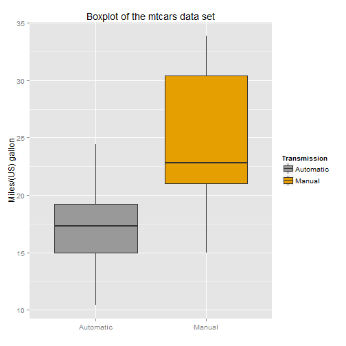
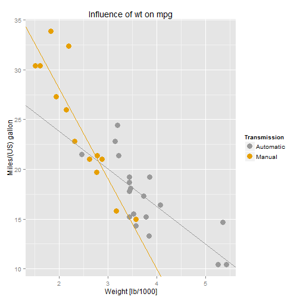
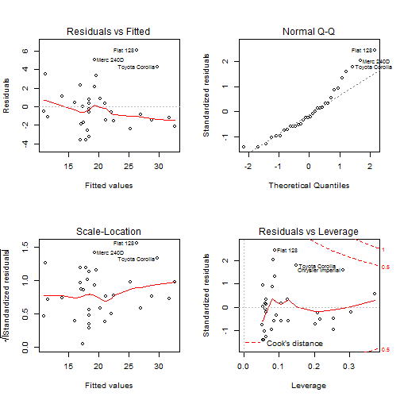

# Executive summary

*Motor Trend*, a magazine about the automobile industry, is interested in exploring the relationship between a set of variables and miles per gallon (MPG) of a data set of a collection of cars. They are paritcularly interested in answering the following questions:

* *"Is an automatic or manual transmission better for MPG"*
* *"Quantify the MPG difference between automatic and manual transmissions"*

To answer this questions, the **mtcars** data set is used. The **mtcars** data set comprises fuel consumption and 10 aspects of automobile design and performance for 32 automobiles (1973-1974 models).

# Loading the data


```r
data(mtcars);
dim(mtcars);
```

```
## [1] 32 11
```

```r
names(mtcars);
```

```
##  [1] "mpg"  "cyl"  "disp" "hp"   "drat" "wt"   "qsec" "vs"   "am"   "gear"
## [11] "carb"
```

As one can see, the data set contains 32 observations on 11 variables (a description of the variables can be found in the Annex).

# Answering the questions / modeling

To get an overview of the effect of the transmission type on the variable **mpg**, a boxplot has been prepared (the code for the boxplot can be found in the Annex).

 

As one can see, **mpg** tends to higher values when the transmission type is *manual*. To quantify this, a linear model was fitted (the summary of the fit can be seen in the Annex):


```r
fit1 <- lm(mpg ~ ., data = mtcars);
```
As it can be seen in the Annex, approx. 87% of the variance are explained with this linear model, further, when looking at the estimates, one can see that the biggest influence on **mpg** comes from the variables **am** (highest estimate) and **wt** (lowest estimate). A new model was fitted (see summary in the Annex):


```r
fit2 <- lm(mpg ~ wt * am, data = mtcars);
```

This new model explains approx. 83% of the variance, hence **am** and **wt** have the biggest influence on **mpg** (figure 1 in the Annex shows the influence of **wt** on **mpg** with respect of the transmission type). Comparing the variances, only 4% less variance is explained when simply using a multiple linear with **wt** and **am** as predictor variables. Hence, this model is good enough to show the influence of **am** and **wt**.

# Conclusion

As seen above and in the Annex (residual analysis), a multiple linear least squares regression is appropriate for modeling this problem. Taking **wt** and **am** as predictor variables to model **mpg**, one can see that a great amount of variance is explained with the model, and that only 4% less variance is explained compared to the first model, where all the variables of the data set were taken into account to model **mpg**. Moreover, the model shows that cars with manual transmission add 14.8784 + (-5.2984)*wt more MPG on average than cars with automatic transmission.

# Annex

## Description of variables
* **mpg** Miles/(US) gallon
* **cyl** Number of cylinders
* **disp** Displacement (cu.in.)
* **hp** Gross horespower
* **drat** Rear axle ratio
* **wt** Weight (lb/1000)
* **qsec** 1/4 mile time
* **vs** V/S
* **am** Transmission (0 = automatic, 1 = manual)
* **gear** Number of forward gears
* **carb** Number of carburetors

## Code for boxplot


```r
library(ggplot2);
mtcars$am <- as.factor(mtcars$am);
levels(mtcars$am) <- c("Automatic", "Manual");
g <- ggplot(data = mtcars, aes(x = am, y = mpg, fill = am)) +
    geom_boxplot() +
    ggtitle("Boxplot of the mtcars data set") +
    ylab("Miles/(US) gallon") +
    xlab("") +
    scale_fill_manual(values = c("#999999", "#E69F00"), name = "Transmission");
print(g);
```

## Summary of fit1

```r
summary(fit1);
```

```
## 
## Call:
## lm(formula = mpg ~ ., data = mtcars)
## 
## Residuals:
##     Min      1Q  Median      3Q     Max 
## -3.4506 -1.6044 -0.1196  1.2193  4.6271 
## 
## Coefficients:
##             Estimate Std. Error t value Pr(>|t|)  
## (Intercept) 12.30337   18.71788   0.657   0.5181  
## cyl         -0.11144    1.04502  -0.107   0.9161  
## disp         0.01334    0.01786   0.747   0.4635  
## hp          -0.02148    0.02177  -0.987   0.3350  
## drat         0.78711    1.63537   0.481   0.6353  
## wt          -3.71530    1.89441  -1.961   0.0633 .
## qsec         0.82104    0.73084   1.123   0.2739  
## vs           0.31776    2.10451   0.151   0.8814  
## amManual     2.52023    2.05665   1.225   0.2340  
## gear         0.65541    1.49326   0.439   0.6652  
## carb        -0.19942    0.82875  -0.241   0.8122  
## ---
## Signif. codes:  0 '***' 0.001 '**' 0.01 '*' 0.05 '.' 0.1 ' ' 1
## 
## Residual standard error: 2.65 on 21 degrees of freedom
## Multiple R-squared:  0.869,	Adjusted R-squared:  0.8066 
## F-statistic: 13.93 on 10 and 21 DF,  p-value: 3.793e-07
```

## Summary of fit2

```r
summary(fit2);
```

```
## 
## Call:
## lm(formula = mpg ~ wt * am, data = mtcars)
## 
## Residuals:
##     Min      1Q  Median      3Q     Max 
## -3.6004 -1.5446 -0.5325  0.9012  6.0909 
## 
## Coefficients:
##             Estimate Std. Error t value Pr(>|t|)    
## (Intercept)  31.4161     3.0201  10.402 4.00e-11 ***
## wt           -3.7859     0.7856  -4.819 4.55e-05 ***
## amManual     14.8784     4.2640   3.489  0.00162 ** 
## wt:amManual  -5.2984     1.4447  -3.667  0.00102 ** 
## ---
## Signif. codes:  0 '***' 0.001 '**' 0.01 '*' 0.05 '.' 0.1 ' ' 1
## 
## Residual standard error: 2.591 on 28 degrees of freedom
## Multiple R-squared:  0.833,	Adjusted R-squared:  0.8151 
## F-statistic: 46.57 on 3 and 28 DF,  p-value: 5.209e-11
```

## Influence of **wt** on **mpg** (figure 1)


```r
g <- ggplot(data = mtcars, aes(x = wt, y = mpg, colour = am)) +
    geom_point(size = 4) +
    scale_colour_manual(values = c("#999999", "#E69F00"), name = "Transmission") +
    ggtitle("Influence of wt on mpg") +
    xlab("Weight [lb/1000]") +
    ylab("Miles/(US) gallon") +
    geom_abline(intercept = coef(fit2)[1], slope = coef(fit2)[2], colour = "#999999") +
    geom_abline(intercept = coef(fit2)[1] + coef(fit2)[3], slope = coef(fit2)[2] + coef(fit2)[4], colour = "#E69F00");
print(g);
```

 

## Residual analysis

```r
par(mfrow = c(2, 2));
plot(fit2);
```

 
