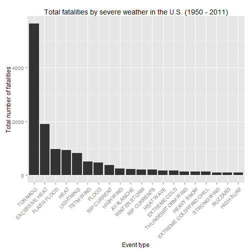

Investigation of the most severe weather events and their impact on economy and public health in the U.S.
=========================================================================================================
<br>

### Introduction
In this report we summarized the impact of the most severe weather events in the U.S. The database we used for this investigation is the [U.S. National Oceanic and Atmospheric Administration's (NOAA)](https://d396qusza40orc.cloudfront.net/repdata%2Fdata%2FStormData.csv.bz2) storm database. This database tracks characteristics of major storms and weather events in the United States, including when and where they occur, as well as estimates of any fatalities, injuries, and property damage. The two main questions we have focused on are the types of events that are the most harmful with respect to population health, and the types of events having the greatest economic consequences.

### Loading needed packages and setting global options
The following packages were used for this analysis, further we have also listed the global options set for **knitr**.


### Data processing
The data set we used for this investigation is the [U.S. National Oceanic and Atmospheric Administration's (NOAA)](https://d396qusza40orc.cloudfront.net/repdata%2Fdata%2FStormData.csv.bz2) storm database (documentation can be found [here](https://d396qusza40orc.cloudfront.net/repdata%2Fpeer2_doc%2Fpd01016005curr.pdf) or [here](https://d396qusza40orc.cloudfront.net/repdata%2Fpeer2_doc%2FNCDC%20Storm%20Events-FAQ%20Page.pdf)).
<br>
For our investigation, we used the above data set and downloaded / unzipped it.

```r
if(!file.exists("./data/stormData.csv.bz2")) {
    download.file("https://d396qusza40orc.cloudfront.net/repdata%2Fdata%2FStormData.csv.bz2", destfile = "./data/stormData.csv.bz2");
}
if(!file.exists("./data/stormData.csv")) {
    bunzip2("./data/stormData.csv.bz2");
}
```
The next step was to load the raw data into R...

```r
data <- read.csv("./data/stormData.csv");
```
...and take a look at it / start preprocessing it. The preprocessing included some small changes to the variable names for easier access and conversion of the **bgn.date** variable, containing the date / time of the event. Further, the year was extracted and appended to the data set for later plotting.

```r
head(data, 1);
dim(data);
names(data) <- tolower(names(data));
names(data) <- gsub("_{1,2}$", "", names(data));
names(data) <- gsub("_", ".", names(data));
data$bgn.date <- as.Date(data$bgn.date, format = "%m/%d/%Y %H:%M:%S");
data$year <- format(as.Date(data$bgn.date, format = "%m/%d/%Y %H:%M:%S"), "%Y");
```
The data set contains **902297** observations between **1950** and **2011**. To get an overview of the various events, the number of unique events listed in the data set as counted.

```r
length(unique(data$evtype));
```

### Results
In the next step, we extracted the **20** most harmful events with respect to population health (first **injuries**, then **fatalities**) by extracting the propriate information and ordering it.

#### Injuries

```r
meltDat <- melt(data, id = c("evtype"), measure.vars = c("fatalities", "injuries", "propdmg", "cropdmg"));
castDat <- dcast(meltDat, evtype ~ variable, sum);
sortedDat <- castDat[order(-castDat$injuries)[1:20],];
g1 <- ggplot(sortedDat, aes(x = evtype, y = injuries)) + geom_bar(stat = "identity") + xlab("Event type") + ylab("Number of injuries") + ggtitle("Total injuries by severe weather in the U.S. (1950 - 2011)") + theme(axis.text.x = element_text(angle = 45, hjust = 1)) + scale_x_discrete(limits = sortedDat$evtype);
print(g1);
```

 
<br>
As one can see, the most harmful events, with respect to all the injuries occured, were tornadoes.

#### Fatalities

```r
sortedDat <- castDat[order(-castDat$fatalities)[1:20],];
g2 <- ggplot(sortedDat, aes(x = evtype, y = fatalities)) + geom_bar(stat = "identity") + xlab("Event type") + ylab("Total number of fatalities") + ggtitle("Total fatalities by severe weather in the U.S. (1950 - 2011)") + theme(axis.text.x = element_text(angle = 45, hjust = 1)) + scale_x_discrete(limits = sortedDat$evtype);
print(g2);
```

 
<br>
As one can see, the most harmful events, with respect to all the fatalities occured, were also tornadoes.

### Most harmful events with respect to economy
In the last step, we extracted the **20** most harmful events with respect to economy (**property damage** / **crop damage**) by using the reordered data set generated from the first question.


```r
sortedDat <- castDat[order(-castDat$propdmg)[1:20],];
g3 <- ggplot(sortedDat, aes(x = evtype, y = propdmg)) + geom_bar(stat = "identity") + xlab("Event type") + ylab("Total sum of property damage caused") + theme(axis.text.x = element_text(angle = 45, hjust = 1, size = 5)) + scale_x_discrete(limits = sortedDat$evtype);
g4 <- ggplot(sortedDat, aes(x = evtype, y = cropdmg)) + geom_bar(stat = "identity") + xlab("Event type") + ylab("Total sum of crop damage caused") + theme(axis.text.x = element_text(angle = 45, hjust = 1, size = 5)) + scale_x_discrete(limits = sortedDat$evtype);
grid.arrange(g3, g4, ncol = 2, main = "Total damages to property and crop");
```

 
<br>
The plots show, that the biggest property damage is caused by tornadoes, floods, thunderstorms, and hail, while the biggest damage to crop is caused by hail. Moreover, tornadoes, floods, and thunderstorms cause significant damage to crop.

### Conclusion
The graphs show, that **tornadoes** are the most harmful in terms of **injuries** and **fatalities**, while on the other hand **hail** causes the most damage to **crop**. Taking a look at **property damage**, one can see **tornadoes, (flash) floods, and thunderstorms** as the most damage causing weather events.
