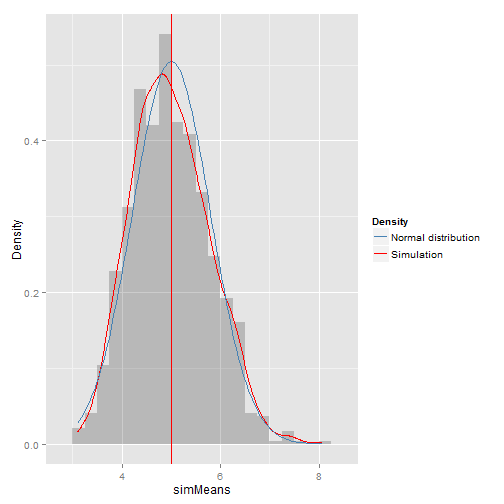
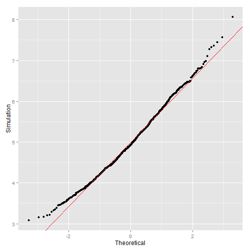

This report was generated to answer the first (simulation) part of the course project. The task is to investigate the exponential distribution in R and compare it with the Central Limit Theorem. The exponential distribution can be simulated in R with $rexp(n, lambda)$ where $lambda~(\lambda)$ is the rate parameter. The mean of exponential distribution is $1/\lambda$ and the standard deviation is also $1/\lambda$.
  
For the following simulation $\lambda$ was set to **0.2**, and the distribution of averages of 40 exponentials was investigated. The **set.seed** function was used to enable reproducibility.

### Simulation

```r
set.seed(1);
lambda <- 0.2;
n <- 40;
noSim <- 1000;
mat <- matrix(rexp(noSim * n, lambda), noSim);
simMeans <- apply(mat, 1, mean);
```

### Comparing sample mean / variance and theoretical mean / variance of the distribution
When comparing the mean of the simulation with the theoretical mean, one can see a great reflection of the theoretical mean by the sample mean.

```r
# simulation mean
mean(simMeans);
```

```
## [1] 4.990025
```

```r
# theoretical mean
1/lambda;
```

```
## [1] 5
```
The same goes for the variability of the system. While the theoretical variance ($\sigma^2/n$) and is 0.625, the variance of the sample means is:

```r
var(simMeans);
```

```
## [1] 0.6177072
```
Visually, this can also be seen when plotting the simulation data, and superimposing it with the standard normal distribution (with mean = 5/$\lambda$, and sd = 5/$\sqrt(40)$.

```r
library(ggplot2);
g <- qplot(simMeans, geom = "blank", ylab = "Density") + 
    geom_histogram(aes(y = ..density..), alpha = 0.25, binwidth = 0.25) +
    geom_line(aes(y = ..density.., colour = "Simulation"), stat = "Density") +
    stat_function(fun = dnorm, aes(colour = "Normal distribution"), arg = list(mean = 5, sd = 5/sqrt(40))) +
    scale_colour_manual(name = "Density", values = c("steelblue", "red")) +
    geom_vline(xintercept = 5, color = "red");
print(g);
```

 

### Comparing the simulation data to the normal distribution
Using the **normal probability plot**, one can compare the simulated data (or any other given data set) with the normal distribution.

```r
g <- qplot(sample = simMeans, stat = "qq", xlab = "Theoretical", ylab = "Simulation") +
    geom_abline(intercept = mean(simMeans), slope = sd(simMeans), color = "red");
print(g);
```

 

This plot, as well as the plot before, show, that the simulation data is approximately normal distributed.
