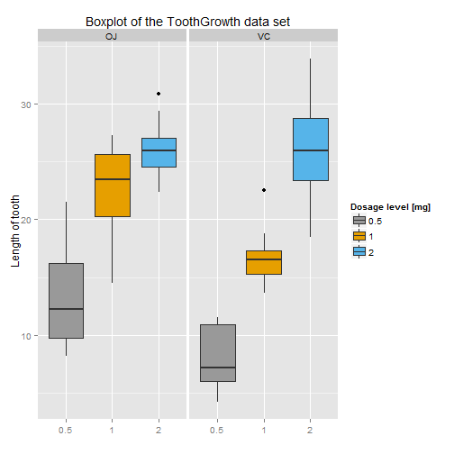

This report was generated to answer the second (basic inferential data analysis) part of the course project. The task is to investigate the **ToothGrowth** data set within the **datasets** library, and do some basic data analysis with it.

The analysis is divided into four parts:
  
* loading the data set
* basic summary of the data
* compare tooth growth by **supp** and **dose**
* conclusion

### Loading the data

The **ToothGrowth** data set is located in the **datasets** library.


```r
library(datasets);
data(ToothGrowth);
```

###  Summary of the data set

The number of observations and variables of the **ToothGrowth** data set is 60, and 3, respectively. The variables of the data set are **len, supp, dose**. The **ToothGrowth** data set is a result of the investigation of the effect of vitamin C on tooth growth in guinea pigs. The length of odontoblasts (teeth) of the 10 guinea pigs, receiving three dose levels of vitamin C (0.5, 1, and 2 mg), with each of two delivery methods: **orange juice (OJ)** and **ascorbic acid (VC)**, is captured in this data set.

To give a visual overview on the effectivity of the two delivery methods as well as the three dose levels of vitamin C, a boxplot can be used.


```r
library(ggplot2);
g <- ggplot(data = ToothGrowth, aes(x = as.factor(dose), y = len, fill = as.factor(dose))) +
    geom_boxplot() +
    facet_grid(. ~ supp) +
    ggtitle("Boxplot of the ToothGrowth data set") +
    ylab("Length of tooth") +
    xlab("") +
    scale_fill_manual(values = c("#999999", "#E69F00", "#56B4E9"), name = "Dosage level [mg]");
print(g);
```

 

The boxplot shows, that the dosage level has the greatest impact on tooth length and that **OJ** is more effective than **VC**. To get more information on the difference between the two delivery methods, more tests are needed.

### Compare tooth growth by **supp** and **dose**

The first step is to check whether there is a difference in the supplement type or not. This can be done using the **t.test** function.


```r
t.test(len ~ supp, data = ToothGrowth);
```

```
## 
## 	Welch Two Sample t-test
## 
## data:  len by supp
## t = 1.9153, df = 55.309, p-value = 0.06063
## alternative hypothesis: true difference in means is not equal to 0
## 95 percent confidence interval:
##  -0.1710156  7.5710156
## sample estimates:
## mean in group OJ mean in group VC 
##         20.66333         16.96333
```

Since the confidence interval contains 0 and the p-value is very low, we have to assume, that there is a significant differrence in between the supplement forms (see boxplot, where it looks like **OJ** being more effective than **VC**).

The first two t-test in the annex show, that there is a significant difference between the supplement forms **OJ** and **VC** at dose levels of **0.5 mg** and **1.0 ** (confidence interval does not contain 0, p-value is close to 1, hence the H0 has to be rejected). In the last t-test, one can see that there is no significant difference between **OJ** and **VC** at a dosage level of **2.0 mg**.

### Conclusion

* There is a significant difference in the delivery method at dosage levels of **0.5 mg** and **1.0 mg**
* Both delivery methods are equally efficient at a dosage level of **2.0 mg**

*Assumptions made for above conclusions*


* Sample guinea pigs are representative of the entire population
* For the t-tests, the variances are assumed to be different, and non-paired tests were performed.

### Annex


```r
sub0.5 <- subset(ToothGrowth, dose == 0.5);
#t.test(sub0.5[1:10, 1], sub0.5[11:20, 1]);
t.test(sub0.5[1:10, 1] - sub0.5[11:20, 1]);
```

```
## 
## 	One Sample t-test
## 
## data:  sub0.5[1:10, 1] - sub0.5[11:20, 1]
## t = -2.9791, df = 9, p-value = 0.01547
## alternative hypothesis: true mean is not equal to 0
## 95 percent confidence interval:
##  -9.236542 -1.263458
## sample estimates:
## mean of x 
##     -5.25
```

```r
sub1.0 <- subset(ToothGrowth, dose == 1.0);
#t.test(sub1.0[1:10, 1], sub1.0[11:20, 1]);
t.test(sub1.0[1:10, 1] - sub1.0[11:20, 1]);
```

```
## 
## 	One Sample t-test
## 
## data:  sub1.0[1:10, 1] - sub1.0[11:20, 1]
## t = -3.3721, df = 9, p-value = 0.008229
## alternative hypothesis: true mean is not equal to 0
## 95 percent confidence interval:
##  -9.908089 -1.951911
## sample estimates:
## mean of x 
##     -5.93
```

```r
sub2.0 <- subset(ToothGrowth, dose == 2.0);
#t.test(sub2.0[1:10, 1], sub2.0[11:20, 1]);
t.test(sub2.0[1:10, 1] - sub2.0[11:20, 1]);
```

```
## 
## 	One Sample t-test
## 
## data:  sub2.0[1:10, 1] - sub2.0[11:20, 1]
## t = 0.0426, df = 9, p-value = 0.967
## alternative hypothesis: true mean is not equal to 0
## 95 percent confidence interval:
##  -4.168976  4.328976
## sample estimates:
## mean of x 
##      0.08
```
